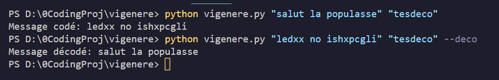

# TP Widmer Module 122 : Documentation

## Comment utiliser le script :
```
python vigenere.py "message a coder" "CleDeCryptage"
```
* Cette commande vous permet d'encrypter une phrase

```
python vigenere.py "message a coder" "CleDeCryptage" --decode
```
* Cette commande vous permet de decrypter une phrase grace au flag 'decode'
qui indique à la fonction main d'utiliser la fonctionalitée de decryptage. 

## Fonctions utilisées pour les scripts :

- encodage_vigenere() demande deux paramètres, une phrase et une clé.
Permet d'encoder n'importe quel phrase avec la méthode vigenere.

- decodage_vigenere() demande deux paramètres, une phrase et une clé.
Permet de decoder n'importe quel phrase avec la méthode vigenere.

- main()
  Cette fonctionn permet dans un premier temps de récupérer les input de l'utilisateurs grace à argparse. Elle détermine ensuite si l'utilisateur veut utiliser la fonction pour chiffrer ou pour déchiffrer. Puis elle retourne à l'utilisateur le résultat des fonctions.

## Documentation sur la lib Argparse :

> La librairie (bibliothèque) **Argparse facilite l'écriture d'interface en ligne de commande.** Le programme définit es
> arguments requis et **argparse s'arrange pour analyser ceux provenant de sys.argv.** Le module argparse **génère aussi
> automatiquement les messages d'aide, le mode d'emploi, et lève des erreurs lorsque les utilisateurs fournissent des
> arguments invalides.**

**_L'interface en ligne de commande du module argparse est basée sur une instance d'argparse.ArgumentParser sur laquelle
les arguments et options de l'analyseur sont déclarés :_**

```
  parser = argparse.ArgumentParser(
                    prog='Programme de Leo et Maudelin',
                    description='Mon programme va ètre utiliser afin de crypter et decrypter',
                    epilog='Click pour obtenir de l'aide)
```

**_La méthode ArgumentParser.add_argument() permet de définir les arguments de l'analyseur. Ceux-ci peuvent être des
arguments positionnels, des arguments optionnels ou des drapeaux (qui sont alors traduits en valeurs booléennes). Les
arguments ont la possibilité d'être complétés par des valeurs._**

```
parser.add_argument('test.txt')           # positional argument
parser.add_argument('-c', '--count')      # option that takes a value
parser.add_argument('-v', '--verbose',
                    action='store_true')  # on/off flag
```

**_On peut utiliser plusieurs arguments lorsqu'on utilise add_Argument()_**

- action = Précise la gestion d'un argument

```
store, store_const,store_true,append,append_const,count,help,versio
```

- choice = Limite le choix à certaines valeurs

```
['foo', 'bar'], range(1, 10) ou une instance de Container
```

- const = Utilise une valeur constante

- default = Valeur à utiliser en l'absence d'un argument

```
None par défauts
```

- dest = Définit le nom de l'attribut à utiliser dans l'espace de nommage résultant

- help = Message d'aide pour l'argument

- metavar = Autre nom possible pour l'argument, est affiché dans l'aide

- nargs = Précise le nombre de répétitions de l'argument

```
int, '?', '*', '+' ou argparse.REMAINDER
```

- required = Précise si l'argument est obligatoire ou optionnel

```
True ou False
```

- type = Conversion automatique vers le type fourni

```
int, float, argparse.FileType('w') ou une fonction
```

**_La méthode ArgumentParser.parse_args(),lance l'analyseur et stocke les résultats dans un objet argparse.Namespace :_
**

```
args = parser.parse_args()
print(args.test.txt, args.count, args.verbose)
```

### Créer un analyseur (parser) :

- la premières étape est de créer un arguments (avec l'objet ArgumentParser)

- **L'objet ArgumentParser contient les info. pour savoir comment interprêter la ligne de commande**

```
parser = argparse.ArgumentParser(description='Process some integers.')
```

### Ajouter des arguments :

- Pour ajouter des arguments,à l'objet ArgumentParser, il faut utiliser la méthode add_argument().
- **On va lui dire commnent interprêtre les lignes de commandes pour ensuite pouvoir le tranformer en objet**
- On va stocké l'informations avant d'uiliser le résultat avec la fonction parse_args().

```
parser.add_argument('integers', metavar='N', type=int, nargs='+',
                    help='an integer for the accumulator')
parser.add_argument('--sum', dest='accumulate', action='store_const',
                    const=sum, default=max,
                    help='sum the integers (default: find the max)')
```

### Analyse des arguments :

- ArgumentParser analyse les arguments avec la méthode parse_args().
- Cette méthode inspecte la ligne de commande,
- Cette méthode inspecte la ligne de commande, convertit chaque argument au type approprié et invoque l'action requise.

- Le resultat est la construction d'un objet Namespace à partir des attributs analysés dans la ligne de commande

```
parser.parse_args(['--sum', '7', '-1', '42'])
Namespace(accumulate=<built-in function sum>, integers=[7, -1, 42])
```

## Fonction chiffrement + tests :

```

import argparse

def codage_vigenere(phrase, key):
    """
    Cette fonction prend en entrée une phrase et une clé et retourne le codage_vigenere du texte en utilisant le chiffrement de Vigenère.

    :param phrase: la phrase à encrypter.
    :param key: la clé à utiliser.
    :les paramètres sont forcément en string vu qu'on est dans la console
    :return: le codage_vigenere du texte (string).
    """
    # On initialise la variable qui contiendra le résultat encrypté
    encrypt_result = ""

    # On initialise la variable qui servira à parcourir la clé
    key_index = 0

    # On parcourt chaque caractère de la phrase à encrypter
    for chara in phrase:
        # Si le caractère est une lettre de l'alphabet
        if chara.isalpha():
            # On convertit la lettre de la clé en ASCII et on la normalise entre 0 et 25 (correspondant aux lettres de l'alphabet)
            shift = ord(key[key_index % len(key)].lower()) - 97

            # On convertit la lettre en ASCII et on la normalise entre 0 et 25 (correspondant aux lettres de l'alphabet)
            chara_ascii = ord(chara.lower()) - 97

            # On applique la formule du chiffrement de Vigenère pour obtenir la lettre encryptée
            encrypted_chara = chr((chara_ascii + shift) % 26 + 97)

            # On ajoute la lettre encryptée au résultat final
            encrypt_result += encrypted_chara

            # On incrémente l'index de la clé pour passer à la lettre suivante
            key_index += 1
        else:
            # Si le caractère n'est pas une lettre de l'alphabet, on ne l'encrypte pas et on l'ajoute directement au résultat final
            encrypt_result += chara

    # On retourne le résultat final
    return encrypt_result

```


## Fonction déchiffrage + tests :

```

def decodage_vigenere(phraseDeco, key):
    """
    Cette fonction prend en paramètres une phrase chiffrée et une clé, et retourne la phrase déchiffrée en utilisant le chiffrement de Vigenère.

    :param phraseDeco: la phrase à déchiffrer.
    :param key: la clé à utiliser.
    :return: la phrase déchiffrée (string).
    """
    # On initialise la variable qui contiendra le résultat décrypté
    decrypt_result = ""

    # On initialise la variable qui servira à parcourir la clé
    key_index = 0

    # On parcourt chaque caractère de la phrase à décrypter
    for chara in phraseDeco:
        # Si le caractère est une lettre de l'alphabet
        if chara.isalpha():
            # On convertit la lettre de la clé en ASCII et on la normalise entre 0 et 25 (correspondant aux lettres de l'alphabet)
            shift = ord(key[key_index % len(key)].lower()) - 97

            # On applique la formule du déchiffrement de Vigenère pour obtenir la lettre décryptée
            decrypted_chara = chr((ord(chara.lower()) - 97 - shift) % 26 + 97)

            # On ajoute la lettre décryptée au résultat final
            decrypt_result += decrypted_chara

            # On incrémente l'index de la clé pour passer à la lettre suivante
            key_index += 1
        else:
            # Si le caractère n'est pas une lettre de l'alphabet, on ne le décrypte pas et on l'ajoute directement au résultat final
            decrypt_result += chara

    # On retourne le résultat final
    return decrypt_result

```



## Fonction main :

```
def main():
    # On crée un objet ArgumentParser pour récupérer les arguments de la ligne de commande
    parser = argparse.ArgumentParser()

    # On ajoute les arguments "phrase" et "key"
    parser.add_argument('phrase')
    parser.add_argument('key')
    # Ajout d'un flag pour le decodage
    parser.add_argument('--decode', action='store_true')
    # On récupère les arguments de la ligne de commande
    args = parser.parse_args()

    # Condition pour savoir quel fonction l'utilisateur veut appeler
    # Les deux conditions fonctionnent de la même manière appel de la fonction,
    # puis print du resultat
    if args.decode:
        decrypt_result = decodage_vigenere(args.phrase, args.key)
        print("Message décodé:", decrypt_result)
    else:
        encrypt_result = encodage_vigenere(args.phrase, args.key)
        print("Message codé:", encrypt_result)

```

## Conclusion :

